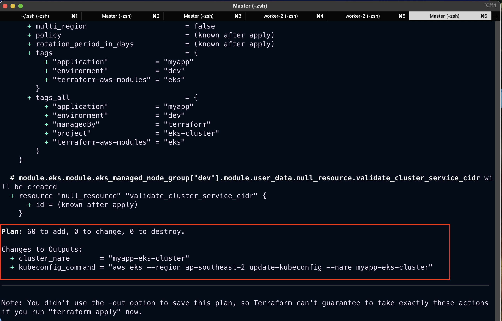
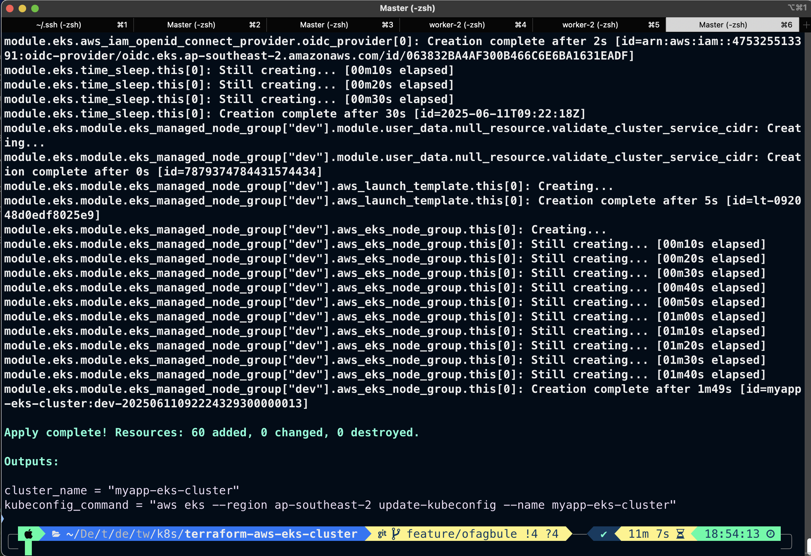
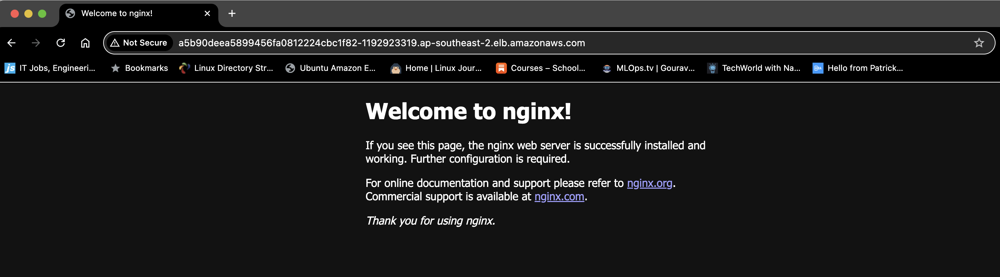

# 🚀 Secure, Scalable EKS Cluster on AWS using Terraform

This project provisions a **secure, scalable Amazon EKS cluster** using **Terraform**, with reusable modules, remote state locking using `use_lockfile`, and full integration with `kubectl`.

---

## 📌 Features

- ☁️ AWS EKS cluster with managed node groups
- 🛡️ Secure and scalable VPC (public/private subnets with NAT)
- 🔐 Remote S3 backend with native Terraform lockfile for state safety
- 📊 Cluster logging enabled (API, Audit, Authenticator, etc.)
- ⚙️ Ready-to-use `kubectl` access

---

## 🧰 Prerequisites

- [Terraform >= 1.5](https://developer.hashicorp.com/terraform/downloads)
- [AWS CLI](https://docs.aws.amazon.com/cli/latest/userguide/install-cliv2.html)
- AWS IAM credentials (via profile or environment variables)
- `kubectl` installed and configured

---

## 📁 Project Structure

```bash
.
├── eks-cluster.tf           # EKS cluster + node groups
├── output.tf                # Useful outputs (e.g. kubeconfig command)
├── providers.tf             # AWS provider + backend config
├── setup-remote.sh          # Script to create S3 backend bucket
├── delete-remote.sh         # Script to delete backend bucket
├── variable.tf              # Input variables
├── vpc.tf                   # VPC, subnets, NAT config
└── imgs/                    # Screenshot images
```

---

## 🌐 Remote Backend (State Management)

- State is stored in an **S3 bucket** created via `setup-remote.sh`
- **Locking is managed via Terraform's `use_lockfile = true`**
- This setup ensures **safe, concurrent** infrastructure changes

---

## 🚦 How to Use

### 🔧 1. Configure Your Variables

Update the `terraform.tfvars` file or use `-var` flags:
```hcl
region                     = "ap-southeast-2"
vpc_cidr_block             = "10.0.0.0/16"
private_subnets_cidr_blocks = ["10.0.1.0/24", "10.0.2.0/24"]
public_subnets_cidr_blocks  = ["10.0.101.0/24", "10.0.102.0/24"]
```

### 🪣 2. Set Up Remote State Bucket

```bash
chmod +x setup-remote.sh
./setup-remote.sh
```

### 📦 3. Initialize Terraform

```bash
terraform init
```

### 🔍 4. Review the Plan

```bash
terraform plan
```

### 🚀 5. Apply the Infrastructure

```bash
terraform apply
```

### 📡 6. Configure `kubectl` Access

```bash
aws eks --region ap-southeast-2 update-kubeconfig --name myapp-eks-cluster
```

Verify access:
```bash
kubectl get nodes
```

---

## 🧼 Tear Down

To clean up infrastructure:
```bash
terraform destroy
```

To delete the remote backend bucket:
```bash
./delete-remote.sh
```

---

## 📸 Screenshots

### ✅ Terraform Plan Output


### ✅ Terraform Apply Complete


### ✅ Kubeconfig + Node Verification


### ✅ NGINX Public Access (LoadBalancer)


---

## 📝 Notes

- **Node type**: `t3.medium` used for a balance between cost and capacity
- **AMI type**: `AL2023_x86_64` for latest Amazon Linux 2023 images
- **Scaling**: Node group configured with `min=1`, `max=3`, `desired=2`

---

## 📎 References

- [Terraform AWS EKS Module](https://registry.terraform.io/modules/terraform-aws-modules/eks/aws)
- [Terraform S3 Backend Docs](https://developer.hashicorp.com/terraform/language/settings/backends/s3)
- [Amazon EKS Docs](https://docs.aws.amazon.com/eks/latest/userguide/what-is-eks.html)

---

## 🙋 Support

Feel free to raise issues or reach out for feedback!